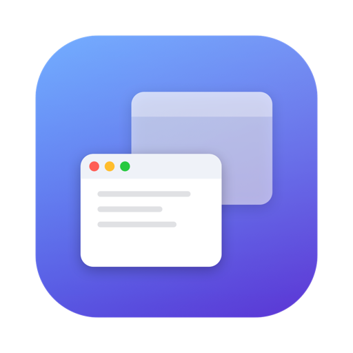

<div align="center">
  
  <h1>UltraSwitch</h1>
  <p>A macOS window switcher that replaces Cmd+Tab with a full-screen picker showing live thumbnails of every open window.</p>
</div>

---

## Why UltraSwitch

The built-in Cmd+Tab switches between *apps*, not *windows*. Flipping between two Chrome windows, or finding one Finder window among five, takes extra clicks every time.

UltraSwitch switches at the **window** level: every open window across every app, each shown as a live thumbnail, driven by the same Cmd+Tab muscle memory you already have.

## Features

- **Window-level switching** — cycle through individual windows, not just apps.
- **Live thumbnails** — each window is captured with ScreenCaptureKit, so you see its real current contents.
- **Familiar controls** — hold **Cmd** and tap **Tab** to move forward, **Shift+Tab** to go back, release **Cmd** to switch.
- **Click to pick** — or click any thumbnail directly.
- **Across Spaces** — windows on other desktops show up too.
- **Fast and quiet** — lives in the menu bar, captures thumbnails in parallel, and appears instantly.

## Controls

| Action | Shortcut |
|---|---|
| Open switcher / cycle forward | `Cmd` + `Tab` |
| Cycle backward | `Cmd` + `Shift` + `Tab` |
| Confirm selection | Release `Cmd` |
| Cancel | `Esc` |
| Pick a window directly | Click its thumbnail |

## Install

Download the latest `UltraSwitch.dmg` from [Releases](https://github.com/ryqdev/ultraswitch/releases), open it, and drag UltraSwitch into Applications.

The build is ad-hoc signed (not notarized through Apple), so on first launch macOS may say the developer can't be verified. Clear the quarantine flag once:

```bash
xattr -cr /Applications/UltraSwitch.app
```

### Permissions

UltraSwitch needs two permissions and prompts for both on first launch:

- **Accessibility** — to capture the Cmd+Tab hotkey and activate windows.
- **Screen Recording** — to render live window thumbnails.

## Build from source

Requires macOS 14+ and a Swift toolchain.

```bash
swift build               # debug build
swift run UltraSwitch     # build and run
swift build -c release    # release build
```

### Generate a DMG

```bash
bash scripts/build-dmg.sh
```

## License

[MIT](LICENSE)
